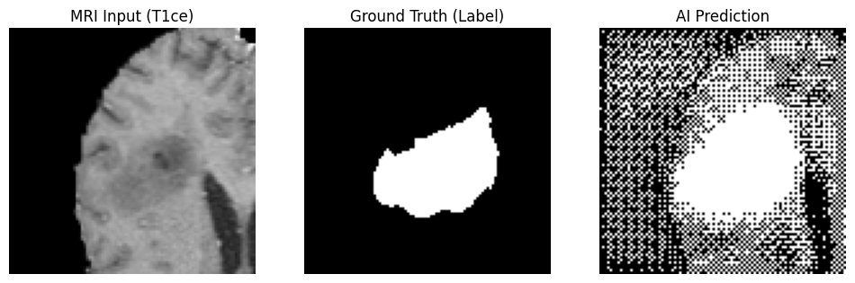
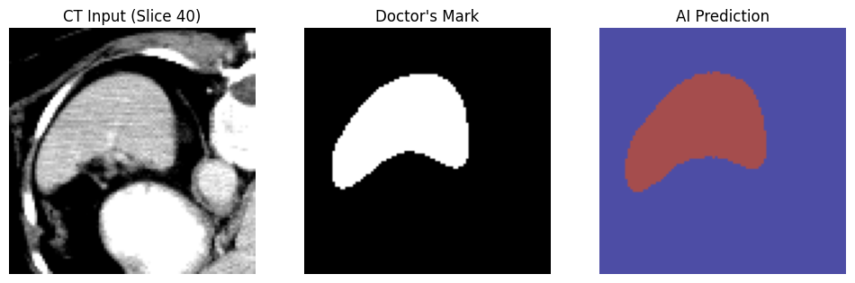
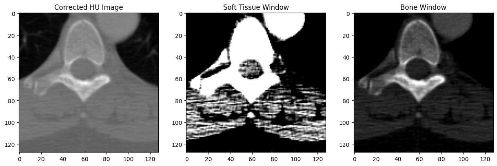

📍 Oxford, UK | ✉️ [Email Me](mailto:vasileios.kourentzis@kellogg.ox.ac.uk) | 🔗 [LinkedIn]([https://www.linkedin.com/in/vkourentz]) | 📄 [CV](./Vasilis_Kourentzis_AI_Engineer.pdf)

---

# Medical AI & Deep Learning Portfolio Overview 🧬💻

A collection of end-to-end machine learning projects focused on clinical data, computer vision, and 3D medical image segmentation. 

**Tech Stack:** PyTorch, MONAI, TensorFlow, Python, C++, NumPy, Pandas
**Medical Data Processing:** DICOM, NIfTI, Hounsfield Unit (HU) windowing, 3D Voxel manipulation

## 1. 3D Brain Tumor Segmentation (MRI)
* **Goal:** Automated segmentation of active brain tumors from 3D MRI scans (T1ce) using Deep Learning.
* **Tools:** PyTorch, MONAI, MSD Brain Tumor Dataset.
* **Highlights:** Processed 3D volumes, built a medical image data pipeline, and visualized AI predictions against ground-truth clinical masks across Axial, Coronal, and Sagittal planes.
* [View Project ➡️](./Computer_Vision_and_Segmentation/3D_Brain_Tumor_Segmentation_MRI.ipynb)

## 2. Spleen Volume Screener (CT)
* **Goal:** Volumetric segmentation of the spleen from patient CT scans to aid in clinical diagnostics.
* **Tools:** PyTorch, MONAI, Decathlon Dataset.
* **Highlights:** Handled large-scale CT dataset extraction, tensor transformations, and GPU-accelerated model inference.
* [View Project ➡️](./Computer_Vision_and_Segmentation/CT_Spleen_Volume_Segmentation.ipynb)

## 3. Medical Imaging Data Pipeline (DICOM & NIfTI)
* **Goal:** Programmatic manipulation of raw hospital imaging data.
* **Tools:** `pydicom`, `nibabel`, Python.
* **Highlights:** Converted raw pixel data to Hounsfield Units (HU), applied clinical windowing (Soft Tissue/Bone), and rendered 3D NumPy arrays into multi-planar anatomical views.
* [View Project ➡️](./Medical_Data_Pipelines/Medical_Imaging_Data_Processing_DICOM_NIfTI.ipynb)

